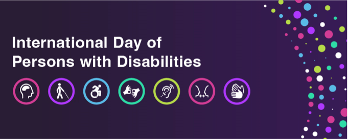
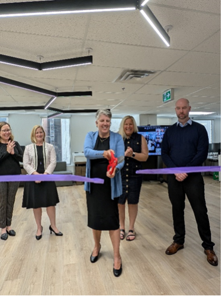
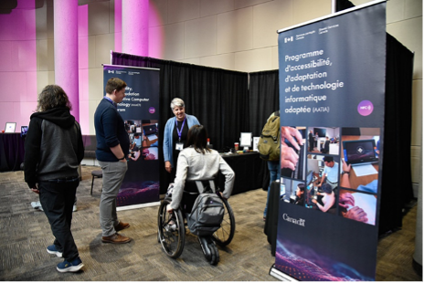

Welcome to our latest edition of *AAACT Now for Accessibility*! In this edition, we celebrate the International Day of Persons with Disabilities. Read on as we share valuable resources and steps that we can all take to foster a more inclusive federal public service.

## On This Page

- [International Day of Persons with Disabilities 2024](#international-day-of-persons-with-disabilities-2024)
- [AAACT’s New Accessible Workspace](#aaact-s-new-accessible-workspace)
- [Shared Services Canada’s Innovative Fair: Wrap-Up](#shared-services-canada-s-innovative-fair-wrap-up)
- [Get to Know the Team](#get-to-know-the-team)
- [Upcoming Accessibility Training and Events](#upcoming-accessibility-training-and-events)
- [Join AAACT’s Virtual Event for IDPD](#join-aaact-s-virtual-event-for-idpd)
- [Digital Accessibility Hack - Accessible Excel Spreadsheets](#digital-accessibility-hack-accessible-excel-spreadsheets)
- [Accessibility Feedback Spotlight](#accessibility-feedback-spotlight)

## International Day of Persons with Disabilities 2024

Alt text: International Day of Persons with Disabilities decorative banner.

As we approach the 2024 International Day of Persons with Disabilities (IDPD) on December 3rd, we take this opportunity to reflect on the importance of inclusivity and empowerment for individuals with disabilities. This year’s theme is "Stop the Stigma, a Call to Action". The Government of Canada (GC) is bringing a focus on the importance of understanding both apparent and non-apparent disabilities in the workplace. As we continue to foster an inclusive work environment, it’s important to recognize the diverse range of disabilities that our colleagues may experience, both apparent and non-apparent.

Apparent disabilities may be visible and easy to recognize, such as physical or sensory disabilities. However, non-apparent disabilities that may not be visible can be equally impactful.  To create a supportive and inclusive work environment, we can approach all people with empathy and understanding and acknowledge that everyone’s experience is unique.

During IDPD 2024 and beyond, we encourage all public servants to educate themselves about different types of workplace barriers that people may face; to encourage open dialogue about barriers and solutions; and to implement inclusive practices into our work.

Accessibility, Accommodation and Adaptive Computer Technology (AAACT) offers training sessions that help explore this topic and provide solutions to barriers that people face in the workplace. Please visit our [GC Accessibility Training and Events page](https://www.gcpedia.gc.ca/wiki/GC_Accessibility_Training_and_Events_/_Formation_et_%C3%A9v%C3%A9nements_du_GC_sur_l%27accessibilit%C3%A9) for more information on upcoming training opportunities. (You need to be on a GC network or connected through a Virtual Private Network to access GCPedia.) We also offer a wide range of adaptations, alternate approaches, tools, services, resources, and adaptive computer technologies for public service employees with disabilities or injuries. If you are wondering about our services and what we have to offer, please visit [How can AAACT help you](https://www.canada.ca/en/shared-services/corporate/aaact-program/how-aaact-help-you.html) web page or email us at [aaact-aatia@ssc-spc.gc.ca](mailto:aaact-aatia@ssc-spc.gc.ca).

On December 3, 2024,  Fisheries and Oceans Canada, in collaboration with the Canada School of Public Service, is hosting an event for federal public servants, titled Understanding Apparent and Non-Apparent Disabilities in the Workplace. This 90-minute virtual event will help us learn more about the experiences of persons with disabilities, with a special focus on non-apparent disabilities. Participants will gain practical tips and key takeaways to foster compassion and inclusion in our workplaces. [Register today](https://catalogue.csps-efpc.gc.ca/product?catalog=IRA1-E49&cm_locale=en) for this important event.

On December 4, 2024, AAACT is hosting an IDPD event for federal public servants. During this 30-minute virtual session, we will give you a virtual glimpse of our new accessible workspace in the National Capital Region and showcase tools that AAACT can provide to address workplace barriers. Together, let’s drive meaningful change and foster a more inclusive, accessible work environment.

## AAACT’s New Accessible Workspace

Alt text: A picture of the Executive Director of Accessibility, and colleagues, cutting a ribbon at the new AAACT accessible workspace.

We’re thrilled to share that our new accessibility client service center for GC employees is nearly complete and ready to make a positive impact! In October, we opened our new workspace at 219 Laurier Avenue West in Ottawa to our AAACT team, and the response has been positive.  Designed with inclusivity in mind, the layout makes it easier to navigate, engage and collaborate.  The space offers a number of solutions, including a sensory room, featuring bubble tubes that help individuals focus and promote a sense of calm.

As we continue to improve the space and ensure it’s accessible for everyone, we’re excited to announce that have opened our doors to clients by appointment. This is a fantastic opportunity for clients to schedule a visit, engage with our team, and test a range of technologies tailored to their specific needs. We believe that hands-on experience is invaluable, and our dedicated team is eager to assist you in finding the right solutions for your needs.

We’re also working towards opening our interactive training rooms. These spaces are designed to enhance our training programs, fostering a collaborative hybrid environment to support skill development. Whether you're looking to refine your existing skills or learn something new, our center will be equipped to meet those needs.

Stay tuned for more information on how to book your appointment and explore all that our new client service center has to offer. We can’t wait to welcome you and help you discover the tools and resources that can make a real difference!

## Shared Services Canada’s Innovative Fair: Wrap-Up

Alt text: A picture of the AAACT booth staff welcoming visitors.

AAACT recently hosted a booth at Shared Services Canada’s (SSC) Innovation Fair. Over 1500 public servants had the opportunity to experience first-hand the innovative technologies and services that we offer. We’re thrilled to share that the feedback we received was overwhelmingly positive!

Our main message resonated strongly: AAACT is dedicated to removing barriers, and we believe anyone can play a part in this important mission.

Here are some of the tools that sparked a lot of questions:

* Tap Strap 2: This all-in-one wearable keyboard, mouse, and air gesture controller drew significant attention, with many eager to learn how it can enhance user experience. AAACT is currently exploring the tool to better understand its benefits.
* Keyboards and ergonomic mice: The large array of alternate keyboards and ergonomic devices sparked numerous inquiries, emphasizing the need for accessible technology solutions.  With AAACT, you can explore the devices to fit your needs.
* 3D printed objects: AAACT is currently exploring 3D printed devices to bridge many issues that people with disabilities face. 3D printing makes it easier, faster and cheaper to customize each device to its user.

While many attendees showed interest in our various technologies, we noticed a lot of questions surrounding accessibility testing. AAACT offers accessibility standards conformance testing and reporting, and user testing with people with disabilities. Additionally, we provide training to help organizations become self-sufficient in their own accessibility testing and quality assurance for Information and Communications Technology (ICT). If you have questions about our testing services and whether we can assist, please contact us at [aaact-aatia@ssc-spc.gc.ca](mailto:aaact-aatia@ssc-spc.gc.ca) for more information.

Thank you to everyone who visited our booth! We look forward to continuing the conversation and working together to remove barriers.

## Get to Know the Team

Text alt: An image of Kateri Clark. She is wearing a bright red jacket and standing outdoors, surrounded by greenery, with a blue sky in the background.

Kateri Clark, a Senior Advisor in AAACT, is a seasoned expert in accessibility strategy. With a master's degree in services planning from Queen's University, she brings nearly 25 years of diverse experience in the federal public service. Over the past seven years at AAACT, she has been instrumental in shaping inclusive practices that enhance accessibility for all.  She works collaboratively with various teams across the GC and within SSC to encourage working together to promote accessibility across the GC.

### How do you explain why accessibility should be a top priority?

Showing leadership by being proactive sets us up for success. We can then support partner departments who want SSC to deliver accessible solutions so they can meet their accessibility commitments. Prioritizing accessibility standards means we deliver conformant solutions, prevent accessibility barriers and spend our budget better. Remediating inaccessible solutions is a very large and expensive undertaking that can take many years and significant resources to complete.

### How do you think SSC has been an accessibility leader in the GC, and what do you want to see happen next?

SSC is leading on several initiatives that are having an impact for the whole of the GC. For example, we provide advice and tools to the GC on accessible ICT procurement. We are also early adopters of the Government of Canada Workplace Accessibility Passport. We design and deliver accessibility training, tools and services, including launching the Lending Library.

I would like to see SSC be the first department to officially adopt the EN 301 549 standard on accessibility requirements for ICT products and services. The standard was adopted by Accessibility Standards Canada and TBS has now endorsed the standard. We can promote innovation by using the standard when delivering accessible ICT products and services to our partner departments and clients.

### How can we all get involved in accessibility initiatives?

Provide feedback through the SSC feedback process or through your own organization. This will identify and break down accessibility barriers by identifying areas needing improvement. I also recommend creating safe spaces for having conversations and open dialogue with your colleagues about accessibility. Discussing challenges and brainstorming solutions in a safe space together will help foster a respectful and inclusive workplace culture by building practices that prioritize accessibility for all.

## Upcoming Accessibility Training and Events

Get ready! AAACT offers accessibility training sessions to empower everyone with the knowledge and tools to create an inclusive environment. For more information on our upcoming training sessions, please visit our [GC Accessibility Training and Events page](https://www.gcpedia.gc.ca/wiki/GC_Accessibility_Training_and_Events_/_Formation_et_%C3%A9v%C3%A9nements_du_GC_sur_l%27accessibilit%C3%A9). (You need to be on a GC network or connected through a Virtual Private Network to access GCPedia.)

We look forward to seeing you this winter!

## Join AAACT’s Virtual Event for IDPD

Join the AAACT team for an inclusive and engaging virtual event! During this unique IDPD 2024 session, we will take you on a virtual glimpse of our new accessible space in the National Capital Region. We will showcase some of the less known tools that employees use to address workplace barriers. We will hear valuable insights that will help you create a more inclusive and accessible work environment.

Event Details:

* Date: December 4, 2024
* Time:

  * English session: 1:00 PM – 1:30 PM (EST)
  * French session: 2:00 PM – 2:30 PM (EST)
* Platform: Webinar via Microsoft Teams
* Sign language Interpretation: Available for both sessions.

This event is open to all GC employees, so please share it widely

We look forward to seeing you at the event!

## Digital Accessibility Hack - Accessible Excel Spreadsheets

Making Excel spreadsheets accessible is important as it helps everyone, including people with disabilities, use the information easily. This creates an inclusive environment where everyone can work together effectively. Accessible spreadsheets are easier to read and navigate, which improves usability and productivity. Overall, accessible spreadsheets ensure that everyone can understand and use the information.

Here are some best practices for making your spreadsheets accessible:

1. **Use the Accessibility Check Function**: Located in the Review tab, this tool helps find accessibility issues in your spreadsheet and shows you how to fix them.
2. **Tables**: Avoid using complex table structures in all documents. If tables include nested tables, merged cells, split cells and/or blank rows / columns, they become difficult for screen readers to navigate. When using a table, design it to be as simple as possible. Assign meaningful names to the headers and rows to facilitate user navigation.
3. **Add text to cell A1**: Text in cell A1 allows screen readers to start reading the worksheet.
4. **Fonts**: Choose fonts and styles that are easy to read, such as Aptos, Arial and Verdana. The minimum font size should be between 11 and 14 points.
5. **Include Alternative Text**: For images, charts, or graphs, add descriptive text so people who cannot see the image understand the message and what is important.
6. **Unique Sheet Tab Names**: Give each sheet a clear, unique name to make it easier for users to navigate the workbook.
7. **Name cells and ranges:** This helps users identify the purpose of cells and ranges.
8. **Use of Colour**: Use a [contrast checking tool](https://webaim.org/resources/contrastchecker/) to check the contrast of the text (foreground) relative to the background. For most text, the contrast ratio must be 4.5:1. Also make sure to not use colour alone as sole mean to communicate information (like using red to indicate bad fields).

By following these practices, you can create spreadsheets that everyone can use and benefit from. To learn more about making your Excel workbooks accessible, visit [Accessible Excel workbooks in Microsoft 365 - Digital Accessibility Toolkit (canada.ca)](https://a11y.canada.ca/en/accessible-excel-workbooks-in-microsoft-365/)

## Accessibility Feedback Spotlight

A comment received through the [SSC’s accessibility feedback form](https://www.canada.ca/en/shared-services/corporate/accessibility/accessibility-feedback.html) is that the “software selected Through [SSC’s accessibility feedback form](https://www.canada.ca/en/shared-services/corporate/accessibility/accessibility-feedback.html), we received a complaint concerning a lack of accessibility in Microsoft SharePoint’s implementation of visuals affecting employees with visual impairments, such as a lack of long descriptions for images and alternative text.

An important feature to enhance accessibility is Alternative Text (Alt Text), which helps describe and convey the meaning of visual elements like images, charts, graphs, and other non-text content.

Did you know? You can add Alt Text to images and visual content in technologies like SharePoint. This ensures that employees who rely on screen readers or other adaptive technologies can understand the context and purpose of visuals.

Here are some tips regarding alt text that we can all do:

* Keep it brief but descriptive: Alt Text should summarize the content and meaning of the visual without being overly lengthy.
* Avoid redundancy: If the visual content is purely decorative and adds no functional value, it's best to mark it as decorative so it doesn’t distract users who rely on screen readers. To learn more, [Web Accessibility Initiative’s Images Tutorial](https://www.w3.org/WAI/tutorials/images/) (English only) provides a simple tutorial for this topic.

Remember to include long descriptions when necessary.

A long description is required for complex images, such as charts and graphs, that cannot be described in 65 characters or less. This description is essential not only for screen reader users but also beneficial for all users, particularly those who are neurodiverse cognitive disabilities. If the long description is not placed directly under the image, a link to the location of the long description and another link back to the original reading location must be provided.

Examples of situations that require a long description include:

* Road map with directions: Describe each step needed to follow the directions.
* Flow chart: Use numbered components to fully describe the process.
* Line graph: Describe trends, then include the data points in a table.

For step-by-step guidance on how to add Alt Text to images and other visuals in SharePoint, please visit the [Microsoft SharePoint Support page](https://support.microsoft.com/en-us/office/add-accessible-pictures-and-media-to-a-sharepoint-online-site-a17dc07d-1184-49d1-adc4-87841644cda4#PickTab=Online) for more information. Additionally, the [Digital Accessibility Toolkit](https://a11y.canada.ca/en/alternative-text-and-long-description-best-practices/) provides best practices to determine the type of alt text needed and tips on writing for simple and complex images.

We welcome your story ideas and comments to improve our newsletter.

Please share our newsletter with your colleagues. They can register [here](https://forms-formulaires.alpha.canada.ca/en/id/clwg9uutq012sx883m3l6gt8p).

Accessibility, Accommodation and Adaptive Computer Technology (AAACT) Program
Shared Services Canada / Government of Canada
[aaact-aatia@ssc-spc.gc.ca](mailto:aaact-aatia@ssc-spc.gc.ca)
